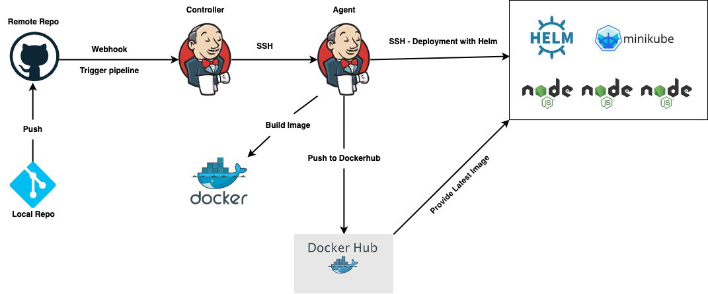

# Jenkins CI/CD Pipeline

## Description

This project implements a CI/CD pipeline for a simple NodeJS application. The pipeline utilizes Jenkins CI/CD server, Docker containers, Docker Hub, AWS EC2, Minikube and Helm.

## Architecture

The CI/CD pipeline integrates:

- AWS EC2: Hosts dockerized application of the Jenkins server, Jenkins agent and Minikube.
- Jenkins Server: Automate build and deployment processes.
- Minikube: Creates a k8s cluster for NodeJS application.
- Helm: Deploys new deployments to Minikube cluster.
- Docker Hub: Hosts docker images created during the build pipeline

## Prerequisites

- Docker Hub repository
- AWS account with three EC2's
- Install on Jenkins Controller docker
- Install on Jenkins Agent docker and Java
- Minikube, Docker and Helm on Minikube EC2 instance
